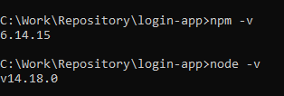
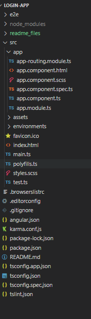
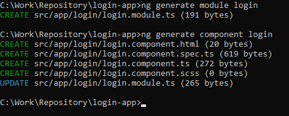
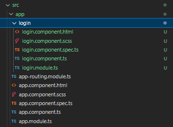

# Sample Angular Login App

- [Sample Angular Login App](#sample-angular-login-app)
  * [Scaffolding the project](#scaffolding-the-project)
  * [Project Structure](#project-structure)
  * [Running the Application](#running-the-application)
  * [Creating your first application](#creating-your-first-application)
    + [Login Page](#login-page)

<br>

## Scaffolding the project

- Install node and npm in [Node Package Installer](https://nodejs.org/download/release/v14.18.0/)

- You should be able to run `node` and `npm` commands on the console



- Install angular package [Angular Setup](https://angular.io/guide/setup-local)

```
npm install -g @angular/cli
```

- You should be able to run `ng` commands on the console


**NOTE**: *You can also install the latest versions of the packages but some parts of the tutorial will throw some errors but should be easily fixable, google is the key*

- Create a new angular project https://angular.io/tutorial/toh-pt0 with the configuration below.


<br>

## Project Structure



- For now focus only on the app folder. This is where you will be working on.
- Angular basic module consists of the following:
    - HTML (app.component.html)
    - SCSS (app.component.scss, based on your selected stylesheet when creating a new project)
    - Spec (app.component.spec.ts, can ignored for now, this is for unit testing)
    - TS (app.component.ts, this is where the display logic happens)
    - Module (app.module.ts, this makes a component to have its own package and dependency management by itself - Modular Frontend)
- The App module will be the container for your whole application.
- The initial scaffold of the project there will already be a sample application of angular documentation links.

<br>

## Running the Application

You can run the application by typing this command to the console in the same directory of the project. For my case, it will be on `C:/Repository/Work/login-app`

```
npm run start
```

or

```
ng serve
```

- Node applications will most of the time have a `package.json` inside a project, this holds some custom scripts that you can run using `npm` and also the list of dependencies installed for your project.

- Once the build is completed and the server is running, you will be able to access the application on [Localhost 4200](http://localhost:4200/)


<br>

## Creating your first application

- Angular follows a concept of microfrontend. This means that a module set should only have a single responsibility.
- For this example, the main app component will be the container only that will reside multiple small modules.
- So we need to create another module sets for the login, register, and a mock dashboard.

### Login Page

- First we need to create another module set by running this command `ng generate <type> <name>` on the console.

```
ng generate module login
```

and then

```
ng generate component login
```

- This will create the module file first in a login folder, then it will create the component files that will be automatically declared as part of the login module.





- Now we create our login page, what we need is a form, some input fields and some buttons
- But before we proceed with that, the reason we create web applications with frameworks is to utilize all the benefits we can have. One of them is we do not need to create native HTML tags like `<input>` or `<button>` and create a custom styling for them.
- We can now utilize the power of [**Material Design**](https://material.io/) that is already integrated with most frameworks. Material design is a predefined set of custom functionalities and design of some of the native HTML tags.
- For angular, to utilize it we need to install it to be part of the node dependencies. [Angular Material](https://v11.material.angular.io/). *The link provided is for angular v11, you can change the version on the top right corner of the site.*

```
ng add @angular/material
```

For Angular 11, we will install a specific version
```
ng add @angular/material@11.2.7
```


- We will also be installing another helpful library in creating a much easier way to position our designs. [Flex Layout Demos](https://tburleson-layouts-demos.firebaseapp.com/#/docs)

```
ng add @angular/flex-layout
```

For Angular 11, we will install a specific version
```
ng add @angular/flex-layout@11.0.0-beta.33
```

- The reason that we use `ng add` instead of `npm install`, some of the angular libraries already has a schematics to update some of the dependent files automatically.
- We will also need to learn how to use the [Angular Forms](https://angular.io/guide/forms-overview). This will be always vital on an angular application to handle dynamic data.

- Now let's start creating the app! Run the application first.
- Check the angular material documentation to check how to implement form, input fields and button.
- Go to your [login.component.html](./src/app/login/login.component.html) and create your initial login form design.
- After you save the file and check your browser, nothing actually happens. The reason is since we are implementing modularization and we already said that all of the module sets are their own package, we need to import the login module to the main module (which is the app module)


- Go to your app.module.ts
- You need to add as part of the import the login module that was created before.
- Now let's go to the `app.component.html` to add the login component that we just made. *Remove the starting template*
- Save the changes and check your console.
- **You will see a lot of error and we will fix it one by one.**

**1. Not a known element**

```
'mat-form-field' is not a known element
```

because in your login component, we already integrated some angular material modules like `mat-form-field`, `matInput` and even `fxLayout`.

If we want to use some packages from a library, we always need to import it on the module where that component belongs, so for our case it will be the `login.module.ts`. Let's open it.

After you add the modules in the imports and save the file. You will now see in the console that some of the not known element error are gone except about the `app-login`.

But you are asking we already imported it on the app module so why does the app module still doesn't know it. 

Because in our login module, we only declared that the login component should be part of this module but there is another step in the module if we want for other modules to use login component and that is called export. Let's open again `login.module.ts`

After editing it, save it and you will see in the console that the errors are gone.

**2. Can't bind since it isn't a known property**

```
Can't bind to 'formGroup' since it isn't a known property of 'form'
```

HTML tags have what we call `attributes`. This attributes are used to inject some functionalities within the tags. We added formGroup attribute in the form tag but we are missing something. 

The `formGroup` attribute is actually part of another built in module of angular to handle forms. What we onl need to do is import another module in the login module.

**3. Does not exist**

```
Property 'loginForm' does not exist on type 'LoginComponent'
```

We already implemented some variables and function calls inside the HTML file but we didn't define or declare any of this inside the TS file. Let's open the TS file.

After we save it, it should now be successful, and no errors should show. If you open the localhost, it should now show what you already created.

### Styling and Design

- It is now time to do some personalization with the application.
- Time for you to explore it!
- Continuation of this tutorial on the next branch. Time to learn GIT :P

```
git checkout lesson2
```